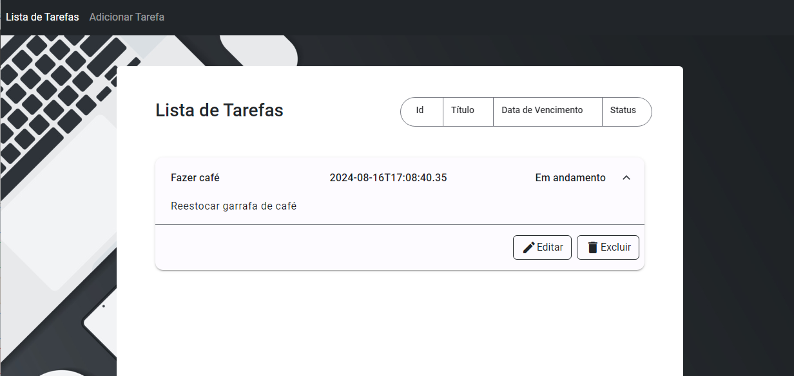

# Gerenciador de Tarefas | Angular 18 & EFCore .NET 8



> Sistema demo com API e Cliente para o gerenciamento de uma entidade simples: Tarefas.

## 💻 Pré-requisitos

Antes de começar, seu ambiente precisa ter:

- Você tem uma máquina `Windows`.
- Você instalou a versão mais recente de `node / npm / angular-cli` para o projeto cliente.
- Você instalou a versão mais recente de `Visual Studio / .NET 8.0 / SqlServer / ` para o projeto servidor.

## 🚀 Instalando o cliente `/App-Tarefas/`

Para executar o projeto, siga estas etapas a partir da raiz do repositório:

```
Execute os comandos abaixo no terminal do Visual Studio Code ou qualquer outro que preferir.
'cd ./appTarefas/'

'ng serve'
```

## 🚀 Instalando o servidor `/API-Tarefas/`

Para executar o projeto, siga estas etapas a partir da raiz do repositório:

```
Abra o Visual Studio com a opção "Abrir um projeto"

Selecione o arquivo .sln contido na pasta ./API-Tarefas

No arquivo 'program.cs', edite o servidor da ConnectionString utilizada para o servidor Sql server instalado na sua máquina.

Compile o projeto.

No console PowerShell do Visual Studio execute o comando: dotnet ef database update

No Visual Studio, lembre-se de executar o projeto com a configuração http
```

## Arquitetura

O sistema foi desenvolvido seguindo os conceitos de Clean Architecture.

O projeto cliente contém a versão mais atual do Angular (18) até a data. 
O projeto segue o padrão de componentes `standalones` como recomendado pela própria empresa para desenvolvimento em novas versões. Isso traz algumas mudanças na injeção de dependência dos módulos utilizados. 


O projeto está divido em 3 camadas: 
- A camada de domínio, com os modelos definidos em `/models`;
- A camada de aplicação onde as regras de negócio ficariam definidas em `/services`;
- E por fim, a camada de Apresentação, com os componentes definidos em `/components`.

Além disso, na raiz do projeto, junto do componente raiz (com apenas `<router-outlet>`) e o arquivo de startup `main.ts`, está presente o `app.routes.ts` que define as rotas dos componentes utilizados.

O projeto servidor realizado também com as versões mais atuais do .NET (8.0) e EntityFrameworkCore (8.0). 

Segue uma arquitetura divida em 2 camadas: 
- A camada de apresentação, com a definição dos endpoints da API, definidos em `/Controllers`;
- E a camada de Aplicação com a definição do contexto e da entidade em `/Application` e as migrations, definidas em `/Migrations`. 

Como escopo do projeto foi apenas 1 entidade, decidi por deixá-la junto ao contexto, mas em projetos reais o aconselhado é separar o context (Infraestutura) de qualquer definição de entidade (Domínio da Aplicação)

###Próximos passos

Acredito que o sistema já tenha atendido todos os requisitos exigidos, mas para completá-lo como um projeto ideal, continuarei com:

- [] Testes Unitários
- [] Sistema de autenticação
- [] Adicionar Regras de negócios para validação no projeto cliente e no servidor


##Referências de Estudos

https://learn.microsoft.com/pt-br/aspnet/core/tutorials/first-web-api?view=aspnetcore-8.0&tabs=visual-studio
https://learn.microsoft.com/pt-br/ef/core/get-started/overview/first-app?tabs=netcore-cli
https://angular.dev/overview
https://material.angular.io/


